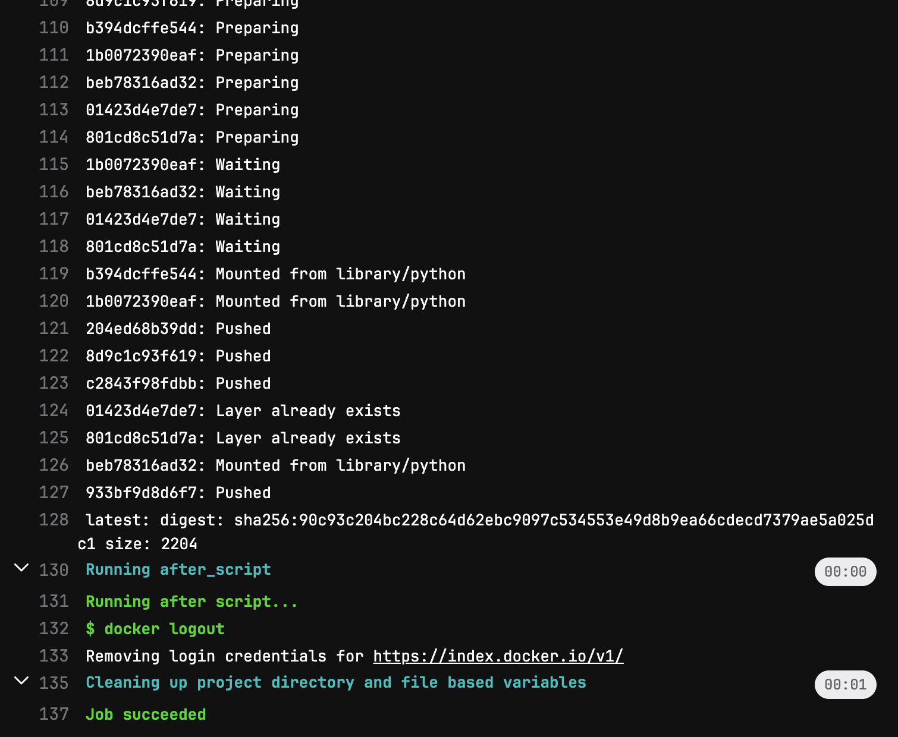
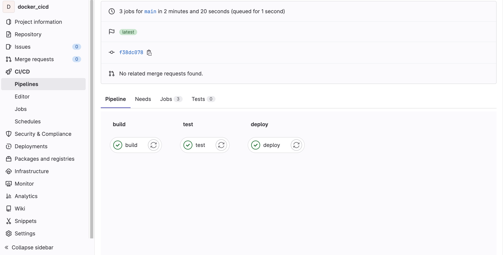

# docker_cicd

This is a simple application to learn the CI/CD in Gitlab with Docker.

## Description
If you want to sart CI/CD with your Docker based application. Or want to make the CI/CD pipeline for your project with deployment into Docker. Then this will be starting point of your journey.

## Badges
On some READMEs, you may see small images that convey metadata, such as whether or not all the tests are passing for the project. You can use Shields to add some to your README. Many services also have instructions for adding a badge.

## Visuals

## Installation
You just need git installed in your system. Then create one free/public account in gitlab. If you don't have docker hub account do that too.

## Usage
Fork and clone my repository into your system. Or simply download as zip. And then create one repo into the gitlab of your account. Add remote repo to your folder. Add all file, commit and push. Go to CICD menu from left and see how it is working.

You have to create the Docker login secrets eg. username and password as well. In GitLab, you can use "Secret Variables" to store sensitive information, such as authentication credentials, that you do not want to store in your repository. To use a Secret Variable in your pipeline, you will need to:

Go to your GitLab project's "Settings" > "CI/CD" > "Variables"
Fill the key and value fields, it's recommended to use a name that makes it clear what the variable is for, for example, "DOCKER_USERNAME" or "DOCKER_PASSWORD"
You can also protect your variables by checking the "Protect variable" checkbox.
Save the variable.
You can then reference the variable in your .gitlab-ci.yml file using the syntax $VARIABLE_NAME.

## Support
Why not take help from internet especiall from ChatGPT :)

## Roadmap
If you want to add and update more into it let me know.

## Contributing
You can contribute into it. Kindly fork and clone first. Then create your branch. Commit to your branch and push to this repo. Create a pull request. Thanks for contributing and sharing with all.

## Authors and acknowledgment
Show your appreciation to those who have contributed to the project.

## License
This is an open source projects, say how it is licensed.

## Project status
I have just created it to help other junior developers. If any one want to be collaborator kindly let me know. Best regards.
